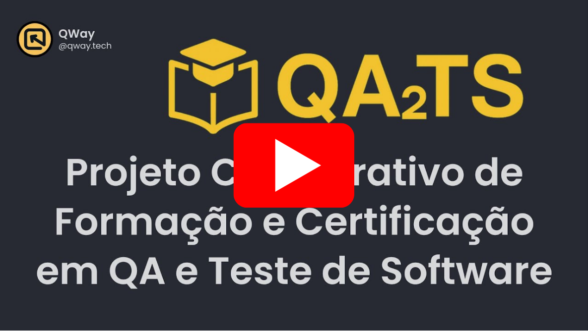

# 🇧🇷 QATS-Brasil – Qualificação Aberta em QA e Teste de Software

Bem-vindo(a) ao repositório oficial da iniciativa **QATS-Brasil**: um projeto open-source, gratuito e comunitário voltado à formação prática em **Qualidade de Software (QA)** e **Testes de Software**.

Nosso objetivo é oferecer uma formação técnica real, com:

- 🧠 Conteúdos baseados em syllabus reconhecidos (ex: ISTQB/CTFL)
- 📚 Referências de normas internacionais (ex: ISO/IEC/IEEE)
- 🇧🇷 Adaptação ao contexto brasileiro e linguagem acessível
- 🤝 Contribuição pública, auditável e 100% comunitária

Tudo construído **por e para a comunidade brasileira de QA**.

---

## 🎥 Apresentação do Projeto QATS

Assista ao vídeo de apresentação da iniciativa, explicando os objetivos, estrutura e formas de contribuição para o projeto de Qualificação Aberta em QA e Testes de Software:

  
*Clique na imagem acima para assistir ao vídeo no YouTube.*

---

## 🧭 Navegue pela Documentação

| Seção                          | Descrição                                                                                       |
|--------------------------------|------------------------------------------------------------------------------------------------|
| [01 - Sobre o Projeto](docs/01-Sobre-o-Projeto.md)         | Missão, visão, valores, governança e apoio institucional.                                   |
| [02 - Como Participar](docs/02-Como-Participar.md)       | Formas de contribuição, regras e como se tornar membro temporário.                       |
| [03 - Trilhas e Programas](docs/03-Trilhas-e-Programas.md)                     | Estrutura das trilhas de formação, módulos e certificação.                       |
| [04 - Licença](docs/04-Licenca.md) | Informações sobre a licença aberta CC BY-SA 4.0.                                 |
| [05 - Recursos Adicionais](docs/05-Recursos-Adicionais.md)             | Links úteis, FAQ futuro, templates e referências externas.                                         |

---

## 🏛️ Instituições Apoiadoras

Apoiam esta iniciativa instituições que:

- Valorizam a qualificação aberta e transparente
- Reconhecem as certificações QATS como parte de seus critérios de avaliação
- Compartilham os valores de ética, acessibilidade e boas práticas no mercado de QA

<table>
  <tr>
    <td width="33%" align="center" valign="middle">
       
      <strong><a href="https://www.qway.com.br">QWay</a></strong> 
      Comunidade global de QA e Testes de Software. Oferece cursos, mentorias, eventos e conteúdos técnicos para profissionais da área.
    </td>
    <td width="33%" align="center" valign="middle">
      <strong>📣 Sua instituição aqui!</strong> 
      Apoie a iniciativa QATS e tenha sua marca reconhecida como parceira da qualificação aberta em QA. 
      <a href="https://github.com/qway-tech/qats-brasil/wiki/07-%E2%80%90-Apoio-Institucional">💬 Saiba como apoiar</a>
    </td>
    <td width="33%" align="center" valign="middle">
      <strong>📣 Seja um apoiador!</strong> 
      Mostre seu compromisso com a educação técnica e ética no mercado de QA. Apoio gratuito e com destaque institucional. 
      <a href="https://github.com/qway-tech/qats-brasil/issues/new?template=apoio-institucional.yml&title=%F0%9F%8F%A2%20[Apoio]%20Nome%20da%20Institui%C3%A7%C3%A3o">💬 Apoie agora</a>
    </td>
  </tr>
</table>

---

Feito com ❤️ pela comunidade de QA no Brasil.
