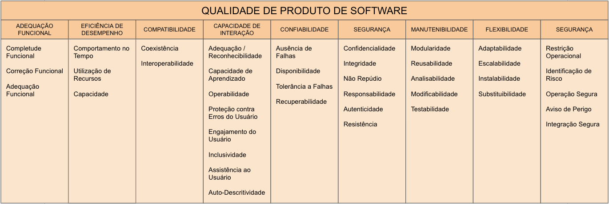
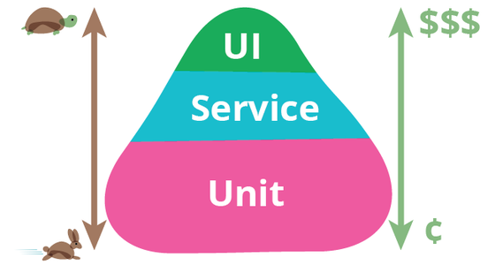
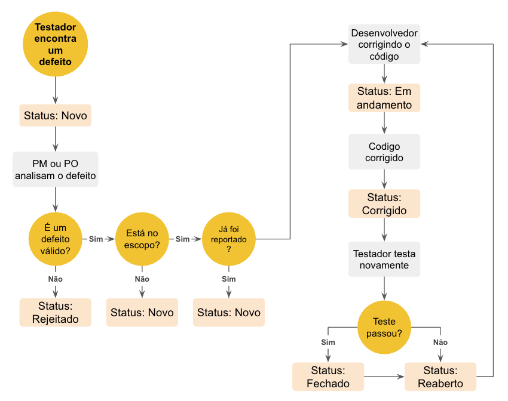
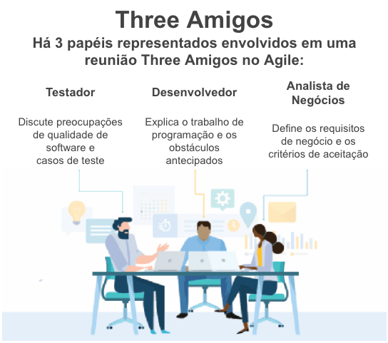
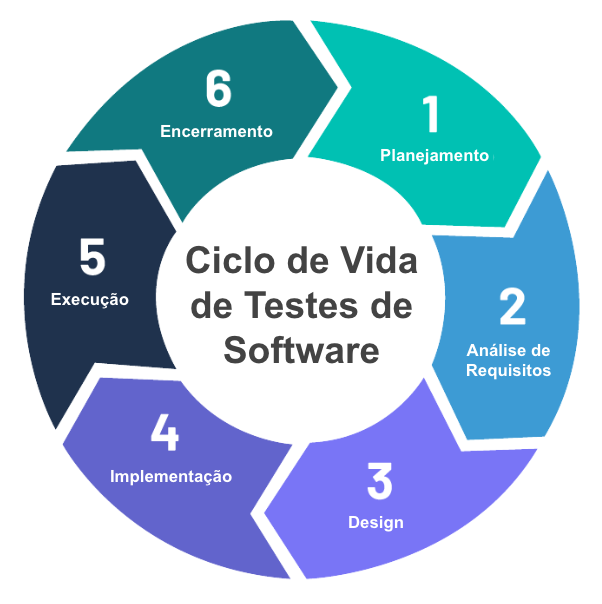
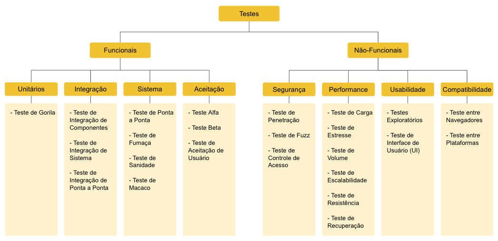

# 📘 Capítulo 1 – Introdução à QA e Testes de Software

## ⏱️ Instruções de Estudo

- **Pré-requisitos:** conhecimento básico de desenvolvimento de software, familiaridade com conceitos de qualidade e processos ágeis.
- **Tempo estimado:** 1h45–2h15  
- **Como estudar:**
  1. Leia o material na ordem sugerida, fazendo anotações.
  2. Monte um glossário pessoal (QA, QC, defeito, falha, regressão, etc.).
  3. Reflita em exemplos práticos do seu contexto de trabalho.
- **Ao final:** realize o **[Quiz do Capítulo](http://academy.qway.com.br/quiz?trilha=t01&modulo=m01&capitulo=c01)** para consolidar o aprendizado.

---

## 1) Qualidade de Software: definição e relevância

**Qualidade de Software** é o grau em que um produto atende aos **requisitos funcionais e não funcionais** e às **necessidades das partes interessadas**, sob restrições de custo, prazo e risco.

Por exemplo, um aplicativo bancário deve não só funcionar corretamente (funcionalidade), mas também garantir segurança e desempenho adequados para evitar fraudes e atrasos.

### 1.1 Modelo de Qualidade (ISO/IEC 25010)
A norma ISO/IEC 25010 organiza a qualidade em **características** e **subcaracterísticas**:

- **Funcionalidade:** adequação funcional, correção, interoperabilidade.  
- **Confiabilidade:** maturidade, tolerância a falhas, recuperabilidade.  
- **Usabilidade:** aprendizado, operabilidade, acessibilidade.  
- **Eficiência de desempenho:** tempo de resposta, uso de recursos.  
- **Segurança:** confidencialidade, integridade, autenticidade, não repúdio.  
- **Compatibilidade:** coexistência, interoperabilidade.  
- **Manutenibilidade:** modularidade, reusabilidade, analisabilidade, modificabilidade, testabilidade.  
- **Portabilidade:** adaptabilidade, instalabilidade, substituibilidade.

  
📷 **Modelo de Qualidade ISO/IEC 25010**

**Exercício Prático:** Escolha um software que você utiliza frequentemente e identifique pelo menos três características de qualidade que são críticas para ele.

---

## 2) QA, QC e Testes — diferenças essenciais

| Conceito | Foco | Natureza | Exemplos |
|---|---|---|---|
| **QA (Quality Assurance / Garantia da Qualidade)** | **Processo** | **Preventivo** | Políticas, padrões, revisões de requisitos, auditorias de processo |
| **QC (Quality Control / Controle da Qualidade)** | **Produto** | **Detectivo** | Inspeções, medições, **testes** |
| **Testes de Software** | Verificação/Validação | Detectivo (parte do QC) | Execução de casos, automação, análise de resultados |

**Explicação adicional:**  
QA é como o planejamento e preparo de uma receita para garantir que o bolo saia perfeito, enquanto QC é a verificação do bolo pronto para garantir que está saboroso e sem defeitos. Testes são parte do QC, focados em encontrar problemas no produto final.

**Exemplo prático:** Uma equipe de QA pode definir padrões para escrever código limpo e revisar requisitos, enquanto a equipe de QC executa testes manuais e automatizados para detectar bugs.

**Exercício Prático:** Liste três atividades que você considera parte da QA e três da QC em seu ambiente de trabalho ou estudo.

---

## 3) Objetivos dos testes de software

- **Aumentar a confiança** no produto.  
- **Evidenciar defeitos** antes da liberação.  
- **Verificar conformidade** com requisitos e critérios de aceitação.  
- **Reduzir riscos** técnicos, de negócio e regulatórios.  

De acordo com o ISTQB, o principal objetivo dos testes de software é evidenciar defeitos antes que cheguem ao usuário. Outros objetivos incluem aumentar a confiança, verificar conformidade e reduzir riscos.

**Explicação adicional:**  
Testes ajudam a evitar que um sistema com falhas chegue ao usuário final, o que poderia causar perdas financeiras, insatisfação ou até problemas legais. Por exemplo, um erro em um sistema de pagamentos pode causar transações incorretas, impactando diretamente o negócio.

> 📝 **Nota:** Os objetivos dos testes de software serão aprofundados no Capítulo 2, incluindo exemplos práticos e discussões sobre metas em diferentes contextos. Aqui, apresentamos apenas uma visão introdutória.

**Exercício Prático:** Pense em um sistema que você já usou e identifique um possível risco que os testes poderiam ter evitado.

---

## 4) Princípios fundamentais de teste (ISTQB)

1. Testes mostram a **presença**, não a ausência de defeitos.
2. Testes **exaustivos são impossíveis** (priorização é essencial).
3. **Começar cedo** reduz custo e tempo.
4. **Defeitos se concentram** em áreas específicas.
5. **Paradoxo do pesticida:** variar técnicas e casos.
6. Testes **dependem do contexto**.
7. **Ausência de erros** não garante um produto **útil**.

**Analogias e exemplos:**  
- O princípio 1 é como testar um carro: se não encontrar defeitos, não significa que não existam.  
- O 5º princípio lembra que usar sempre os mesmos testes é como usar sempre o mesmo pesticida na lavoura, que deixa de funcionar com o tempo.

> 📝 **Nota:** O Capítulo 2 trará um detalhamento completo de cada princípio, com exemplos práticos, históricos e aplicações em diferentes contextos. Aqui, apresentamos apenas um panorama inicial.

**Exercício Prático:** Identifique uma situação em que começar o teste cedo poderia ter evitado retrabalho.

---

## 5) Erro, defeito e falha

- **Erro (mistake):** engano humano (ex.: interpretar mal uma regra).  
- **Defeito (defect/bug):** desvio no artefato (código, requisito, design) que **pode** causar falha.  
- **Falha (failure):** manifestação do defeito durante a execução do software.

**Exemplo prático:**  
Um desenvolvedor comete um erro ao entender um requisito, introduzindo um defeito no código. Quando o usuário tenta uma funcionalidade, o sistema trava — essa é a falha.

**Exercício Prático:** Dê um exemplo de erro, defeito e falha que você já presenciou ou imaginou.

---

## 6) Tipos e níveis de teste

### 6.1 Tipos
- **Funcionais:** validam **comportamentos observáveis** (regras de negócio, integrações, fluxos).  
- **Não funcionais:** validam **atributos de qualidade** (desempenho, segurança, usabilidade, compatibilidade, confiabilidade).

### 6.2 Níveis
- **Unidade:** partes pequenas do código (tipicamente pelo dev).  
- **Integração:** interação entre unidades/módulos/serviços.  
- **Sistema:** o sistema completo de ponta a ponta.  
- **Aceitação:** valida valor para o negócio/usuário conforme critérios de aceitação.

**Exemplos práticos:**  
- Teste de unidade: verificar se uma função de cálculo retorna o valor esperado.  
- Teste de integração: garantir que o módulo de pagamento se comunica corretamente com o sistema bancário.  
- Teste de sistema: validar o fluxo completo de compra no site.  
- Teste de aceitação: cliente aprova se o sistema atende às suas necessidades.

  
📷 **Pirâmide de Testes**

**Exercício Prático:** Identifique quais níveis de teste você já realizou ou conhece e dê um exemplo para cada.

---

## 7) Regressão e exploratório

- **Regressão:** assegura que mudanças (correções, novas funcionalidades) **não quebraram** comportamentos existentes.  
- **Exploratório:** abordagem **baseada em aprendizado e experiência**, em que o testador **aprende, projeta e executa** simultaneamente.

**Explicação adicional:**  
Testes de regressão são como revisitar uma receita que você já sabe fazer para garantir que nenhuma alteração estragou o resultado. Testes exploratórios são como experimentar novos ingredientes para descobrir novos sabores.

**Exercício Prático:** Descreva uma situação onde um teste exploratório poderia revelar um problema que testes automatizados não encontrariam.

---

## 8) Documentação, rastreabilidade e evidências

- **Documentação de testes:** objetivo, escopo, dados, passos essenciais, resultado esperado/obtido.  
- **Matriz de rastreabilidade:** liga **requisitos → casos → resultados → defeitos**.  
- **Evidências:** prints, logs, vídeos, relatórios automatizados.  

**Exemplo prático:**  
Um bug report deve conter informações claras para que qualquer pessoa consiga reproduzir o problema. Por exemplo, incluir o ambiente (sistema operacional, versão do software), passos para reproduzir, resultado esperado e obtido.

  
📷 **Estrutura de Bug Report bem feito**

**Exercício Prático:** Crie um pequeno bug report fictício para um problema simples que você já encontrou.

---

## 9) Ambientes de teste

- **Ambiente de teste:** cópia controlada (parcial/total) do ambiente real para executar testes com segurança.  
- **Boas práticas:** dados de teste adequados e protegidos, *seeding* de massa, isolamento, versionamento de infraestrutura, *feature flags*.

**Explicação adicional:**  
Ter um ambiente de teste estável e isolado evita interferências externas e garante que os testes reflitam a realidade. Por exemplo, usar dados anonimizados para proteger informações sensíveis.

**Exercício Prático:** Liste três cuidados que você considera importantes para manter um ambiente de teste confiável.

---

## 10) Papéis, responsabilidades e colaboração

- **Qualidade é responsabilidade de toda a equipe** (devs, QAs, POs, UX, negócio, infra).  
- **QAs/Testadores:** planejam e implementam testes, analisam riscos, definem dados de teste, executam e comunicam resultados.  
- **Product Owner/Cliente:** respondem pelos critérios de aceitação e aprovam entregas.  
- **Práticas colaborativas:** *Refinement*, *Planning*, *Three Amigos* (Negócio + Dev + QA).

Importante: o QA não é responsável por desenvolver funcionalidades do sistema, mas sim por apoiar a equipe na definição de critérios de qualidade, execução e análise de testes.

  
📷 **Three Amigos – colaboração em Ágil**

**Exemplo prático:** Em uma reunião *Three Amigos*, o QA pode sugerir cenários de teste que o PO não havia considerado, melhorando a cobertura.

**Exercício Prático:** Pense em como você pode colaborar melhor com outras áreas para garantir a qualidade do produto.

---

## 11) Relato de defeitos eficaz (bug report)

Um bom bug report deve ser:

- **Claro** e **objetivo**  
- **Reproduzível**  
- Útil à correção  

**Estrutura recomendada:**
- Título descritivo  
- Ambiente/contexto  
- Pré-condições  
- Passos para reproduzir  
- Resultado obtido vs. esperado  
- Evidências  
- Severidade e prioridade  

**Exemplo fictício de bug report:**

- **Título:** Erro ao salvar perfil do usuário no sistema web  
- **Ambiente:** Navegador Chrome 114.0, Windows 10  
- **Pré-condições:** Usuário logado com permissão de edição  
- **Passos para reproduzir:**  
  1. Acessar a página de perfil  
  2. Alterar o campo "Nome"  
  3. Clicar em "Salvar"  
- **Resultado obtido:** Mensagem de erro "Falha ao salvar dados" e alterações não são salvas  
- **Resultado esperado:** Alterações salvas com sucesso e mensagem de confirmação  
- **Evidências:** Print da tela com a mensagem de erro  
- **Severidade:** Alta  
- **Prioridade:** Urgente

**Exercício Prático:** Crie um bug report para um problema comum que você já tenha encontrado em um software.

---

## 12) STLC – Ciclo de Vida do Teste

1. **Planejamento**  
2. **Análise**  
3. **Design**  
4. **Implementação/Preparação**  
5. **Execução**  
6. **Encerramento**  

| Fase               | Atividades Principais                              |
|--------------------|---------------------------------------------------|
| Planejamento       | Definir escopo, recursos, cronograma              |
| Análise           | Revisar requisitos, identificar riscos             |
| Design            | Criar casos de teste, critérios de aceitação       |
| Implementação      | Preparar scripts, dados de teste                    |
| Execução          | Executar testes, registrar resultados               |
| Encerramento      | Avaliar resultados, reportar métricas, lições aprendidas |

📷 **Ciclo de Vida do Teste – STLC**

> 📝 **Nota:** O Capítulo 3 irá explorar como o STLC se integra aos principais modelos de desenvolvimento de software, como Cascata, V-Model, Espiral e Ágil, detalhando adaptações e exemplos práticos.

**Exercício Prático:** Escolha uma fase do STLC e descreva como você realizaria suas atividades em um projeto real.

---

## 13) Técnicas de teste (panorama)

- **Baseadas em especificação (caixa-preta):** particionamento de equivalência, valores-limite, tabelas de decisão, transição de estados.  
- **Baseadas em estrutura (caixa-branca):** cobertura por instrução/decisão/condição/caminho.  
- **Baseadas em experiência:** exploratório, *error guessing*, *checklists*.

**Exemplos práticos:**  
- Valores-limite: testar entradas no limite inferior e superior para evitar erros como estouro de buffer.  
- Cobertura por decisão: garantir que todas as decisões no código sejam testadas ao menos uma vez.  
- Error guessing: um testador experiente tenta prever onde erros podem ocorrer, por exemplo, inserindo dados inválidos.

  
📷 **Técnicas de Teste**

**Exercício Prático:** Escolha uma técnica de teste e aplique-a a um cenário simples, como um formulário de login.

---

## 14) Qualidade em processos ágeis

- **Envolvimento do QA desde o início**.  
- **Automação e regressão contínua** integradas ao pipeline de CI/CD.  
- **Colaboração constante** com negócio e devs.  
- **Métricas úteis:** taxa de defeitos, tempo de correção, cobertura de testes críticos, *escape rate*.  
- **Práticas adicionais:**  
  - **TDD (Test-Driven Development):** escrever testes antes do código para garantir qualidade desde o início.  
  - **BDD (Behavior-Driven Development):** definir comportamentos esperados em linguagem natural para alinhamento entre time.  
  - **QA como quality coach:** atuar como facilitador da qualidade, promovendo boas práticas e capacitação da equipe.

**Exercício Prático:** Reflita sobre como a automação e práticas ágeis podem melhorar a qualidade em seu contexto.

---

## 📖 Referências Bibliográficas

- **ISTQB CTFL Syllabus 4.0 – Capítulo 1**  
- **ISO/IEC/IEEE 29119-1:2013** — *Software Testing – Concepts and Definitions*  
- **ISO/IEC 25010:2011** — *Systems and Software Quality Models*  
- **IEEE 730:2014** — *Software Quality Assurance Plans*  
- Myers, Glenford J. **The Art of Software Testing**. Wiley.  
- Kaner, Cem; Bach, James; Pettichord, Bret. **Lessons Learned in Software Testing**. Wiley.  
- Fowler, Martin. **Test Pyramid** – martinfowler.com  
- Crispin, Lisa; Gregory, Janet. **Agile Testing: A Practical Guide for Testers and Agile Teams**.  
- Black, Rex. **Foundations of Software Testing: ISTQB Certification**.

---

## ✅ Checklist de estudo

- [ ] Diferencio QA, QC e Testes.  
- [ ] Conheço os 7 princípios de teste.  
- [ ] Sei distinguir tipos (funcionais x não funcionais) e níveis (unidade, integração, sistema, aceitação).  
- [ ] Entendo regressão e exploratório.  
- [ ] Consigo produzir bug reports claros e reproduzíveis.  
- [ ] Conheço as fases do STLC.  
- [ ] Compreendo rastreabilidade e evidências.  
- [ ] Sei quem aprova entregas e como o QA colabora no processo.

---

### 🚀 Próximo passo
Conclua seus estudos realizando o **[Quiz do Capítulo](http://academy.qway.com.br/quiz?trilha=t01&modulo=m01&capitulo=c01)**

---

## Mini Glossário

- **QA (Quality Assurance / Garantia da Qualidade):** conjunto de atividades preventivas para garantir a qualidade do processo e produto.  
- **QC (Quality Control):** conjunto de atividades detectivas para identificar defeitos no produto.  
- **STLC (Software Testing Life Cycle):** ciclo de vida do teste, desde planejamento até encerramento.  
- **Defeito (Defect):** falha no artefato que pode causar problemas no software.  
- **Falha (Failure):** manifestação do defeito durante a execução do software.  
- **Regressão:** teste para garantir que mudanças não introduziram novos defeitos.

---

## Desafio Bônus

Crie um bug report fictício a partir do seguinte cenário:

> "Ao tentar adicionar um produto ao carrinho em um e-commerce, o sistema não atualiza o total da compra e não exibe mensagem de erro."

Use a estrutura recomendada para elaborar seu relatório e compartilhe com seu grupo ou tutor para feedback.