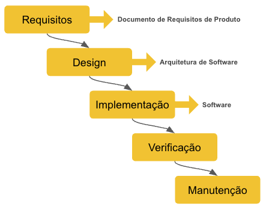
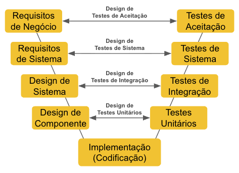
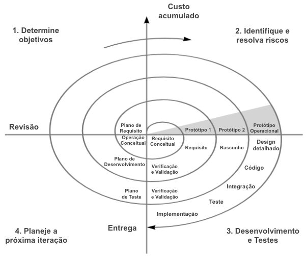
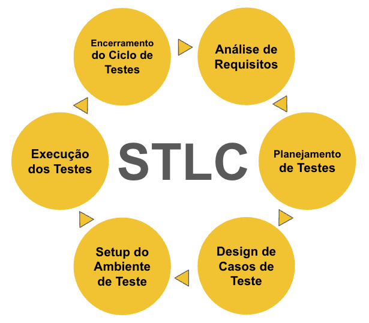

# 📘 Capítulo 3 – Ciclo de Vida do Desenvolvimento e dos Testes

---

## Definição de Ciclo de Vida de Software (SDLC)

O **Ciclo de Vida de Software (SDLC)** é o conjunto de etapas para criar, manter e evoluir software, abrangendo desde a concepção inicial até a entrega e manutenção contínua do produto.

---

## ⏱️ Instruções de Estudo

- **Pré-requisitos:** Leitura dos capítulos anteriores (Introdução, Princípios e Objetivos dos Testes).  
- **Nota de transição:** Este capítulo dá continuidade aos fundamentos apresentados no Capítulo 1 e aos princípios e objetivos discutidos no Capítulo 2, mostrando agora como os testes se encaixam nos diferentes ciclos de vida do desenvolvimento de software, destacando a importância da integração dos testes em cada modelo.  
- **Tempo estimado:** 2h–2h30  
- **Como estudar:**
  1. Leia o material completo e compare os modelos de ciclo de vida apresentados.
  2. Analise como os testes são inseridos em cada modelo.
  3. Faça anotações sobre vantagens e limitações de cada abordagem.
  4. Reflita sobre experiências pessoais (ou hipotéticas) em projetos que utilizaram diferentes ciclos.
- **Ao final:** realize o **[Quiz do Capítulo](http://academy.qway.com.br/quiz?trilha=t01&modulo=m01&capitulo=c03)**.

---

## 1) Modelos de Desenvolvimento de Software

### 1.1 Cascata (Waterfall)

O modelo em cascata é um dos primeiros modelos formais de desenvolvimento de software, proposto originalmente por Winston Royce em 1970. Ele é **sequencial**, onde cada fase deve ser concluída antes do início da próxima: requisitos → design → implementação → testes → manutenção.  

Este modelo foi amplamente utilizado em projetos tradicionais, especialmente em ambientes onde os requisitos são bem definidos e estáveis, como em sistemas regulatórios, governamentais e industriais.  

**Contexto histórico:** Na época, o foco era garantir documentação e controle rigoroso, o que fazia do cascata uma escolha natural para projetos com alta criticidade e pouca tolerância a mudanças.  

**Exemplos de falhas por testes tardios:** Como os testes ocorrem apenas após a implementação, erros críticos podem ser detectados muito tarde, causando atrasos e custos elevados. Por exemplo, em projetos de sistemas bancários antigos, a falta de testes antecipados levou a falhas que só foram descobertas em produção, gerando impactos financeiros e reputacionais sérios.  

- **Vantagens:** simplicidade, fácil de gerenciar, boa documentação.  
- **Limitações:** baixa flexibilidade para mudanças, testes tardios, alto risco de retrabalho.  

📷 **Cascata**

**Exercício prático:** Liste situações em que o modelo cascata ainda pode ser útil (ex.: projetos regulatórios).

---

### 1.2 V-Model

O V-Model é uma evolução do cascata que enfatiza a ligação direta entre cada fase de desenvolvimento e uma fase correspondente de teste, formando um “V”. Isso reforça a importância do **planejamento de testes antecipado** e da validação contínua.  

| Fase de Desenvolvimento       | Fase de Teste Correspondente        | Descrição                                   |
|------------------------------|------------------------------------|---------------------------------------------|
| Requisitos                   | Testes de Aceitação                 | Garantir que o produto atende às necessidades do usuário. |
| Design de Sistema            | Testes de Sistema                   | Verificar a integração dos componentes.     |
| Design de Componentes        | Testes de Integração                | Validar interação entre módulos.             |
| Implementação (Codificação) | Testes Unitários                   | Testar funcionalidades individuais.         |

Essa correspondência ajuda a detectar defeitos mais cedo, reduzindo custos e riscos.  

- **Vantagens:** melhor rastreabilidade, testes planejados desde o início, alinhamento entre desenvolvimento e QA.  
- **Limitações:** ainda rígido para mudanças rápidas, pode ser burocrático.  

📷 **V-Model**

**Exercício prático:** Relacione fases de desenvolvimento e os tipos de teste associados.

---

### 1.3 Modelo Espiral

O modelo espiral, proposto por Barry Boehm em 1986, combina o modelo cascata com ciclos iterativos, enfatizando a **análise de riscos** em cada iteração. A ideia é que o projeto passe por várias “voltas” ou ciclos, cada um contendo quatro quadrantes principais:  

1. **Planejamento:** definição de objetivos, alternativas e restrições.  
2. **Análise de Risco:** identificação e avaliação dos riscos técnicos e gerenciais.  
3. **Desenvolvimento:** criação de protótipos, implementação e testes.  
4. **Validação:** revisão dos resultados, planejamento da próxima volta.  

**Nota:** Embora o modelo espiral utilize prototipação como parte do processo para avaliar riscos e requisitos, ele não deve ser confundido com o "Modelo de Prototipação", que tem foco exclusivo na criação rápida de protótipos para feedback dos usuários.

**Exemplo prático:** Em um projeto aeroespacial, o time pode iniciar com um protótipo básico para avaliar riscos técnicos, depois iterar para melhorar funcionalidades e reduzir incertezas, testando e validando a cada ciclo.  

- **Vantagens:** abordagem flexível, foco no gerenciamento de riscos, adaptável a mudanças.  
- **Limitações:** pode ser complexo de gerenciar, requer experiência para avaliação de riscos eficaz.  

📷 **Espiral**

---

### 1.4 Modelos Ágeis

Modelos ágeis, como Scrum, Kanban e Extreme Programming (XP), abordam o desenvolvimento de forma **incremental e iterativa**, promovendo entregas frequentes e adaptação contínua.  

**Cerimônias do Scrum:**  
- **Sprint:** período fixo (geralmente 2-4 semanas) onde um conjunto de tarefas é desenvolvido.  
- **Sprint Review:** reunião para apresentar e revisar o trabalho concluído durante a Sprint.  
- **Retrospectiva:** encontro para discutir o que funcionou bem e o que pode ser melhorado no processo.  
- **Daily Scrum:** reunião diária rápida para alinhamento do time sobre progresso e impedimentos.

**Backlog:** lista priorizada de requisitos, funcionalidades e tarefas que guiam o trabalho do time.

**Práticas específicas de QA em Ágil incluem:**  
- **TDD (Test-Driven Development):** escrever testes antes do código para garantir qualidade desde o início.  
- **BDD (Behavior-Driven Development):** criação de cenários baseados em comportamento esperado, facilitando comunicação entre times.  
- **Integração Contínua (CI):** automação da build e testes para detectar defeitos rapidamente.  
- **Entrega Contínua (CD):** extensão da Integração Contínua que automatiza a entrega do software em ambientes de produção ou pré-produção, permitindo lançamentos frequentes e confiáveis.  
  - **Diferença entre CI e CD:** CI foca na integração e testes automatizados após cada alteração no código, enquanto CD automatiza a entrega dessas alterações para ambientes finais, reduzindo o tempo entre desenvolvimento e disponibilização para o usuário.

**Responsabilidades de QA no Ágil:**  
- Participar ativamente do *refinement* para garantir critérios de aceitação claros e testáveis.  
- Colaborar no *planning* para estimar esforço e definir prioridades de teste.  
- Auxiliar nas *reviews* para validar entregas e garantir cobertura adequada.  

- **Vantagens:** alta flexibilidade, feedback rápido, forte colaboração entre times.  
- **Limitações:** requer disciplina e maturidade do time, pode ser desafiador em ambientes regulados.  

**Exemplo prático:** Em Scrum, QAs participam desde o *refinement* para garantir critérios de aceitação claros.

---

### 1.5 Modelo de Prototipação

O modelo de prototipação enfatiza a criação rápida de protótipos funcionais ou parciais do sistema para obter feedback precoce dos usuários e stakeholders. Essa abordagem permite validar requisitos e ajustar funcionalidades antes do desenvolvimento completo, reduzindo riscos de retrabalho.

- **Vantagens:** rápida validação de requisitos, melhor comunicação com usuários, redução de erros de entendimento.  
- **Limitações:** pode levar a expectativas irreais se o protótipo for confundido com o produto final, risco de foco excessivo no protótipo em detrimento da arquitetura completa.  

**Exemplo prático:** Em um projeto de aplicativo móvel, o time cria um protótipo navegável para testar a usabilidade com usuários finais antes de iniciar o desenvolvimento completo.

---

## 2) Ciclo de Vida do Teste (STLC)

O **Software Testing Life Cycle (STLC)** organiza o processo de teste em fases estruturadas, garantindo que o teste seja planejado, executado e encerrado de forma eficaz.  

1. **Planejamento:** definir escopo, recursos, cronograma e estratégia de teste.  
   - *Artefatos:* Plano de Teste, Matriz de Rastreabilidade.  
2. **Análise:** revisar requisitos, identificar riscos e definir critérios de entrada.  
   - *Artefatos:* Documentos de requisitos analisados, matriz de riscos.  
3. **Design:** criar casos de teste, critérios de aceitação e preparar dados de teste.  
   - *Artefatos:* Casos de Teste, Scripts de Teste, Dados de Teste.  
4. **Implementação:** preparar scripts automatizados, configurar ambiente e validar dados.  
   - *Artefatos:* Scripts de Automação, Ambiente Configurado.  
5. **Execução:** rodar testes, registrar resultados, reportar e acompanhar defeitos.  
   - *Artefatos:* Relatórios de Teste, Logs de Execução, Registro de Defeitos.  
6. **Encerramento:** avaliar métricas, documentar lições aprendidas e arquivar artefatos.  
   - *Artefatos:* Relatório Final de Teste, Métricas, Documentação de Lições Aprendidas.  

**Observação:** O Capítulo 1 trouxe uma introdução ao STLC; aqui aprofundamos cada fase, conectando-a diretamente ao ciclo de desenvolvimento para reforçar a integração entre times de desenvolvimento e QA.  

📷 **STLC**

**Exercício prático:** Escolha uma fase do STLC e descreva como você atuaria nela em um projeto real.

---

## 3) Integração dos Testes nas Fases do Projeto

A integração dos testes em cada fase do ciclo de vida do projeto é essencial para garantir qualidade e reduzir riscos.  

| Fase do SDLC       | Atividades de QA                                | Exemplos Práticos                             | Boas Práticas                            | Erros Comuns                            |
|--------------------|------------------------------------------------|----------------------------------------------|-----------------------------------------|----------------------------------------|
| Requisitos         | Revisão e validação, definição de critérios    | QA participa de workshops para esclarecer requisitos | Garantir testabilidade e clareza       | Ignorar requisitos ambíguos            |
| Design             | Identificação de riscos, planejamento de testes| Mapear cenários críticos e fluxos alternativos | Documentar casos de uso e fluxos        | Falta de análise de riscos             |
| Implementação      | Testes unitários, automação, integração contínua| Desenvolver scripts automatizados, rodar testes em CI | Automatizar testes repetitivos          | Testar só manualmente e tarde          |
| Entrega           | Testes de aceitação, validação de valor de negócio| Realizar testes de usuário, validar requisitos finais | Envolver usuários finais nos testes     | Liberar sem validação adequada         |
| Manutenção        | Testes de regressão, correções, melhorias contínuas | Monitorar defeitos em produção, aplicar patches e atualizações | Garantir estabilidade e evolução do sistema | Negligenciar correções pós-entrega     |

---

## 4) Papéis e Responsabilidades do QA

O papel do QA evoluiu conforme os modelos de desenvolvimento. Abaixo, uma comparação entre os papéis em ambientes tradicionais, ágeis e DevOps:  

| Aspecto                      | Tradicional                         | Ágil                                 | DevOps                               |
|------------------------------|-----------------------------------|-------------------------------------|------------------------------------|
| Envolvimento                 | Fases finais                      | Desde o início, colaborativo        | Contínuo, integrado ao pipeline    |
| Responsabilidades            | Testes manuais, validação final   | Automação, TDD, BDD, colaboração    | Automação total, monitoramento, feedback rápido |
| Foco                        | Encontrar defeitos                | Prevenir defeitos, qualidade contínua | Garantia de qualidade em produção  |
| Ferramentas                  | Testes manuais, scripts isolados  | Ferramentas ágeis, CI/CD            | Pipelines CI/CD, monitoramento contínuo |
| Tendências                  | Testes tardios                   | **Shift-left testing** (testar cedo) | **Shift-right testing** (testar em produção) |
| Papel do QA Coach           | Raro                            | Facilita processos e cultura        | Promove automação e integração     |
| Pipeline CI/CD              | -                                | -                                   | Fluxo automatizado que integra construção (build), testes automatizados e entrega contínua, garantindo que o software seja validado e disponibilizado rapidamente com alta qualidade. |

**Shift-left testing:** mover atividades de QA para estágios iniciais do desenvolvimento para detectar defeitos mais cedo.  
**Shift-right testing:** monitorar e testar o software em produção para identificar problemas em tempo real e melhorar continuamente.  

---

## 📖 Referências Bibliográficas

- **ISTQB CTFL Syllabus 4.0 – Capítulo 2**  
- **ISO/IEC/IEEE 29119-2:2013** — *Software Testing Process*  
- **IEEE 829:2008** — *Test Documentation*  
- Sommerville, Ian. **Engenharia de Software**  
- Pressman, Roger. **Engenharia de Software: Uma Abordagem Profissional**  
- Crispin, Lisa & Gregory, Janet. **Agile Testing: A Practical Guide for Testers and Agile Teams**  
- Humble, Jez & Farley, David. **Continuous Delivery: Reliable Software Releases through Build, Test, and Deployment Automation**

---

## ✅ Checklist de Estudo

- [ ] Sei diferenciar Cascata, V-Model, Espiral e Ágil.  
- [ ] Conheço as fases do STLC.  
- [ ] Relaciono fases de desenvolvimento e fases de teste.  
- [ ] Entendo a diferença do papel do QA em abordagens tradicionais, ágeis e DevOps.  
- [ ] Compreendo os conceitos de shift-left e shift-right testing.  

---

## 🚀 Próximo passo

Conclua seus estudos realizando o **[Quiz do Capítulo](http://academy.qway.com.br/quiz?trilha=t01&modulo=m01&capitulo=c03)**

---

## Mini Glossário

- **STLC (Software Testing Life Cycle):** ciclo de vida do teste, do planejamento ao encerramento.  
- **V-Model:** modelo de desenvolvimento que conecta fases de desenvolvimento e teste.  
- **Iterativo:** processo que repete ciclos para evolução do software.  
- **Incremental:** entrega progressiva de partes do software em pequenos releases.  
- **Shift-left:** prática de realizar testes e atividades de QA nas fases iniciais do desenvolvimento para prevenir defeitos.  
- **Shift-right:** prática de monitorar e testar o software em produção para identificar problemas e melhorar continuamente.  
- **DevOps:** cultura e conjunto de práticas que unem desenvolvimento e operações para entrega contínua e confiável.  
- **QA Coach:** profissional que orienta times e organizações na adoção de práticas de qualidade e melhoria contínua.  

---

## Desafio Bônus

Crie um quadro comparativo entre dois modelos de desenvolvimento (por exemplo, Cascata x Ágil), destacando:  
- Diferenças na forma como os testes são conduzidos  
- Vantagens e limitações de cada modelo  
- Exemplos de projetos que poderiam se beneficiar de cada abordagem  

Além disso, escreva uma análise crítica sobre as vantagens e desvantagens de cada modelo no contexto do seu ambiente de trabalho ou estudo, considerando fatores como cultura organizacional, tipo de projeto e recursos disponíveis. Explique qual modelo você recomendaria e por quê.